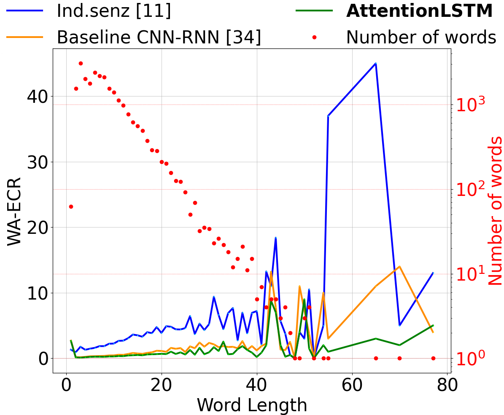
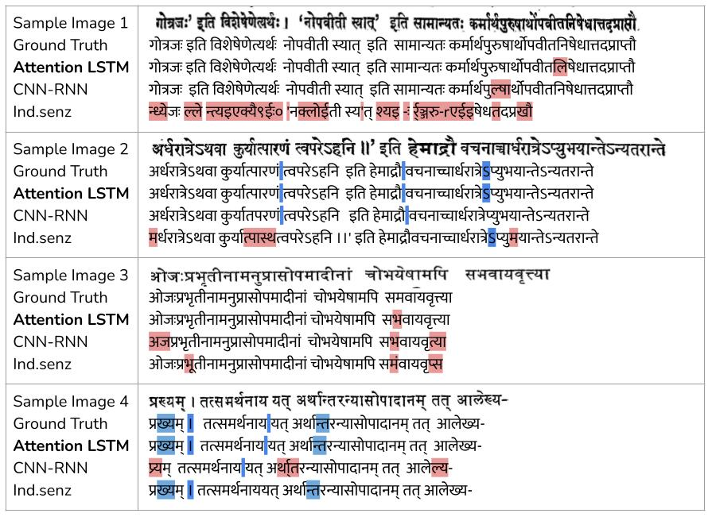

# sanskrit-ocr

*Note: This branch contains code for IndicOCR-v1. For IndicOCR-v2, kindly visit the [main](https://github.com/ihdia/sanskrit-ocr/tree/main) branch.*


----------------------------------------------------------------------------

This repository contains code for various OCR models meant to process classical Sanskrit Document Images. For a quick understanding of how to get the **IndicOCR** and **CNN-RNN** up and running, kindly continue to read this Readme. For more detailed instructions, visit our  [Wiki](https://github.com/ihdia/sanskrit-ocr/wiki) page.

The IndicOCR model and CNN-RNN models are best run on a GPU.

Please cite [our paper](https://openaccess.thecvf.com/content_CVPRW_2020/papers/w34/Dwivedi_An_OCR_for_Classical_Indic_Documents_Containing_Arbitrarily_Long_Words_CVPRW_2020_paper.pdf) if you end up using it for your own research.


```
@InProceedings{Dwivedi_2020_CVPR_Workshops,
author = {Dwivedi, Agam and Saluja, Rohit and Kiran Sarvadevabhatla, Ravi},
title = {An OCR for Classical Indic Documents Containing Arbitrarily Long Words},
booktitle = {The IEEE/CVF Conference on Computer Vision and Pattern Recognition (CVPR) Workshops},
month = {June},
year = {2020}
}
```
-----------------------------------------------------------------------------------------------------

# Results:

The following table shows the comparitive results for the IndicOCR-v1 model with other state of the art models.

|Row |**Dataset**|**Model**|Training Config| CER (%)| WER (%)|
|----|-------------|--------|----------|-----|----|
1 | old | Attention LSTM| C3:mix training + real finetune | **3.71** | **15.97**  
2 | old | Attention LSTM| C2:synth. training + real finetune | 4.59 | 17.97
3 | old | Attention LSTM| C1:mix training | 5.18 | 19.14
4 | old | CNN-RNN | C3:mix training + real finetune | 4.72 | 22.53
5 | old | CNN-RNN | C2:synth. training + real finetune | 4.78 | 22.97
6 | old | CNN-RNN | C1:mix training | 4.83 | 23.04
7 | old | Ind.senz|  -- | 25.66 | 40.81 
8 | old | Google OCR| -- | 12.90 | 40.80 
9 | old | Tesseract| -- | 17.96 | 69.89 

## IndicOCR-v1:

### Quick-Setup:

**Prepare Image:**


### Details:

The code is written in **tensorflow** framework.

### Pre-Trained Models:

To download our best models, kindly visit this page.

### Setup:

In the model/attention-lstm directory, run the following commands:
```
create conda create -n indicOCR python=3.6.10
conda activate indicOCR
conda install pip
pip install -r requirements.txt
```

### Installation:
To install the `aocr` (attention-ocr) library, from the model/attention-lstm directory, run:

```
python setup.py install
```

#### tfrecords creation:

Make sure to have/create a `.txt` file with every line of the file in the following format:

`path/to/image<space>annotation`

**ex:** `/user/sanskrit-ocr/datasets/train/1.jpg I am the annotated text`

```
aocr dataset /path/to/txt/file/ /path/to/data.tfrecords
```

### Train:

To train the `data.tfrecords` file created as described above, run the following command.

```
CUDA_VISIBLE_DEVICES=0 aocr train /path/to/tfrecords/file --batch-size <batch-size> --max-width <max-width> --max-height <max-height> --max-prediction <max-predicted-label-length> --num-epoch <num-epoch>
```

### Validate:

To validate many checkpoints, run 

```
python ./model/evaluate/attention_predictions.py <initial_ckpt_no> <final_ckpt_step> <steps_per_checkpoint>
```

This will create a `val_preds.txt` file in the model/attention-lstm/logs folder.

### Test

To test a single checkpoint, run the following command:

```
CUDA_VISIBLE_DEVICES=0 aocr test /path/to/test.tfrecords --batch-size <batch-size> --max-width <max-width> --max-height <max-height> --max-prediction <max-predicted-label-length> --model-dir ./modelss
```

*Note: If you want to test multiple checkpoints which are evenly spaced (numbering wise), use the method described in the [validation](#Validate) section.*

### Computing Error Rates:

To compute the CER and WER of the predictions, run the following command:

```
python ./model/evaluate/get_errorrates.py <predicted_file_name>
```

**ex:** `python model/evaluate/get_errorrates.py val_preds.txt`

The results of error rates will be written to a file `output.json` in the `visualize` directory.

## CNN-RNN:

### Details:

The code is written in **tensorflow** framework.

### Pre-Trained Models:

To download the best CNN-RNN model, kindly visit this page.

### Setup:

In the model/CNN-RNN directory, run the following commands:
```
create conda create -n crnn python=3.6.10
conda activate crnn
conda install pip
pip install -r requirements.txt
```

#### tfrecords creation:

Make sure to have/create a `.txt` file with every line of the file in the following format:

`path/to/image<space>annotation`

**ex:** `/user/sanskrit-ocr/datasets/train/1.jpg I am the annotated text`

```
python model/CRNN/create_tfrecords.py /path/to/.txt/file ./model/CRNN/data/tfReal/data.tfrecords
```

### Train:

To train the `data.tfrecords` file created as described above, run the following command.

```
python model/CRNN/train.py <training tfrecords filename> <train_epochs> <path_to_previous_saved_model> <steps-per_checkpoint>
```
**ex:** `python ./model/CRNN/train.py train_feature.tfrecords 20 model/CRNN/model/shadownet/shadownet_-40 200`

*Note: If you are training from scratch just set the `<path_to_previous_saved_model>` arguement to 0.*

**ex:** `python model/CRNN/train.py data.tfrecords 100 0 <steps-per_checkpoint>`

### Validate:

To validate many checkpoints, run 

```
python ./model/evaluate/crnn_predictions.py <tfrecords_file_name> <initial_step> <final_step> <steps_per_checkpoint> <out_file>
```

This will create a `out_file` in the model/CRNN/logs folder.

*Note: the `tfrecords_file_name` should be relative to the `model/CRNN/data/tfReal/` directory.*

### Test

Same as above

### Computing Error Rates:

To compute the CER and WER of the predictions, run the following command:

**Validation:**
```
python model/evaluate/get_errorrates_crnn.py <path_to_predicted_file>
```

**Test:**
```
python model/evaluate/get_errorrates_crnn.py <path_to_predicted_file>
```

**ex:** `python model/evaluate/get_errorrates_crnn.py model/CRNN/logs/test_preds_final.txt`


----------------------------------------------------------------------------

*Note: To know how to get results for Tessaract and Google-OCR kindly visit our [Wiki](https://github.com/ihdia/sanskrit-ocr/wiki) page.*

----------------------------------------------------

# Other-Analysis:

### WA-ECR Plot:

To gain a better insight into performance, we compute the word-averaged erroneous character rate (WA-ECR). This is defined as follows: 

**WA-ECR:** = E/N

Where:

- E: number of erroneous characters across all words of length L
- N : number of L length words in the test set.


----------------------------------------------------



Figure: Distribution of word-averaged erroneous character rate (WA-ECR)  as a function of length, for different models. The lower WA-ECR the better. The test words histogram in terms of word lengths can also be seen in the plot (red dots, log scale).


-------------------------------------------------------

### Sample Results:



Figure: Qualitative results for different models. Errors relative to ground truth are highlighted in red. Blue highlighting indicates text missing from at least one of the OCRs. A larger amount of blue within a line for an OCR indicates better coverage relative to others OCRs. Smaller amount of red indicates absence of errors.
